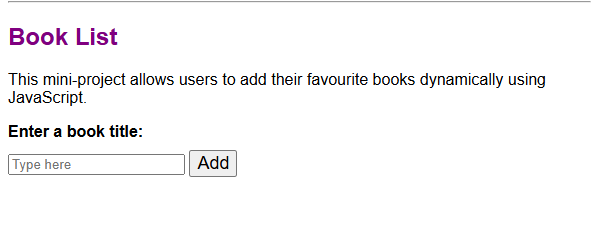

# Header changing and Book-list app

This project combines two JavaScript exercises:

1. Header Toggle – Click a button to dynamically change the page heading.
2. Book List App – Add your favourite books to a list using form input and JavaScript logic.

## Features
- DOM manipulation
- Event handling
- Form validation

## What I Learned
- Working with arrays and loops
- Using if/else statements for conditional logic
- Updating the DOM based on user input

## How to Run
Open `index.html` in your browser. 
All logic handled in `script.js`. 
Located within `itol-js-react/Booklist.header.app/` folder.

